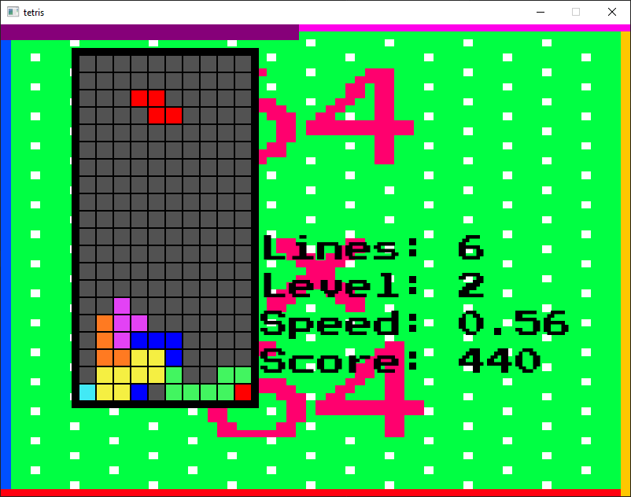
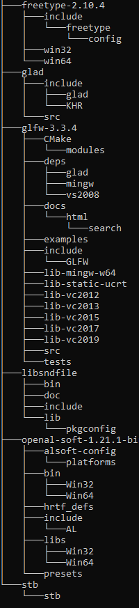
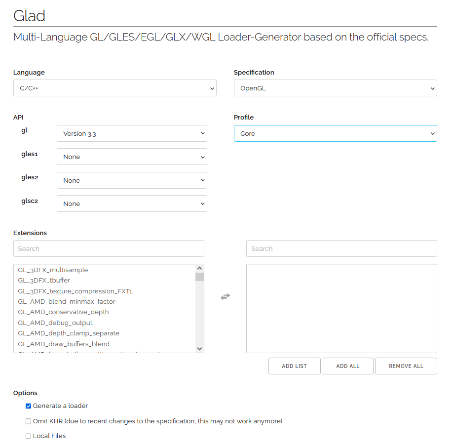

# Tetris

## Building
_Only tested on Windows, though should work fine on Linux given enough tweaking._

You are going to need a few libraries to get started.

All libraries are expected to be in a directory entitled "vendor" in the root of the project. CMake explicitly checks
this directory in order to generate the build files.

## File Heirachy

All source files should be placed in accordance to this file hierarchy

### Freetype 2.10.4
https://github.com/ubawurinna/freetype-windows-binaries/releases/tag/v2.10.4

### GLAD
https://glad.dav1d.de/

Generate glad source files using these settings, then unzip in accordance to the outlined file hierarchy

### GLFW 3.3.4
https://www.glfw.org/download.html

https://github.com/glfw/glfw/releases/download/3.3.4/glfw-3.3.4.bin.WIN64.zip

### libsndfile
http://www.mega-nerd.com/libsndfile/

http://www.mega-nerd.com/libsndfile/files/libsndfile-1.0.28-w64-setup.exe

Install and then copy the libsndfile directory from the install directory into vendor.

### openal-soft
https://openal-soft.org/

https://openal-soft.org/openal-binaries/openal-soft-1.21.1-bin.zip

### STB
https://github.com/nothings/stb/blob/master/stb_image.h

Place in folder entitled "stb" in vendor.